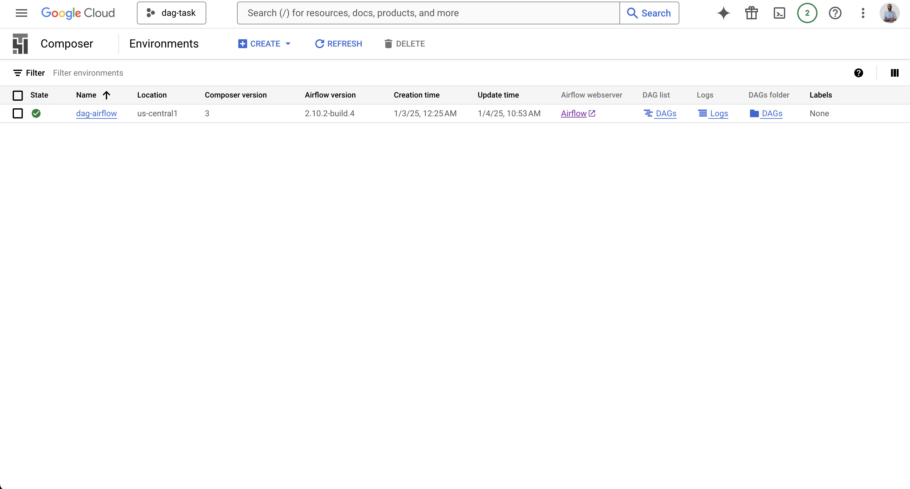
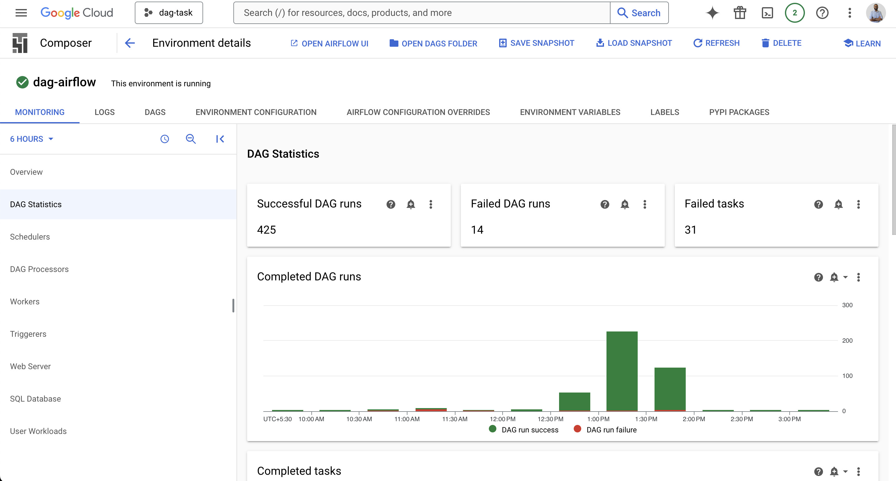
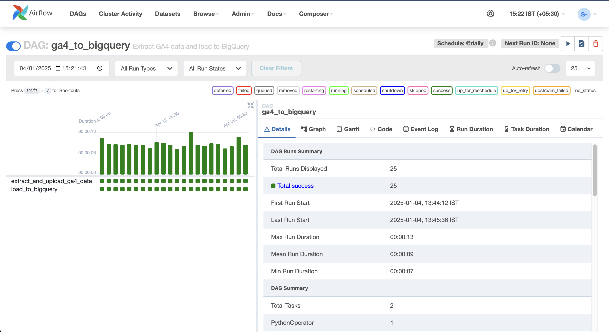
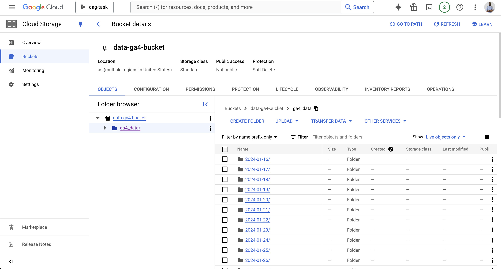
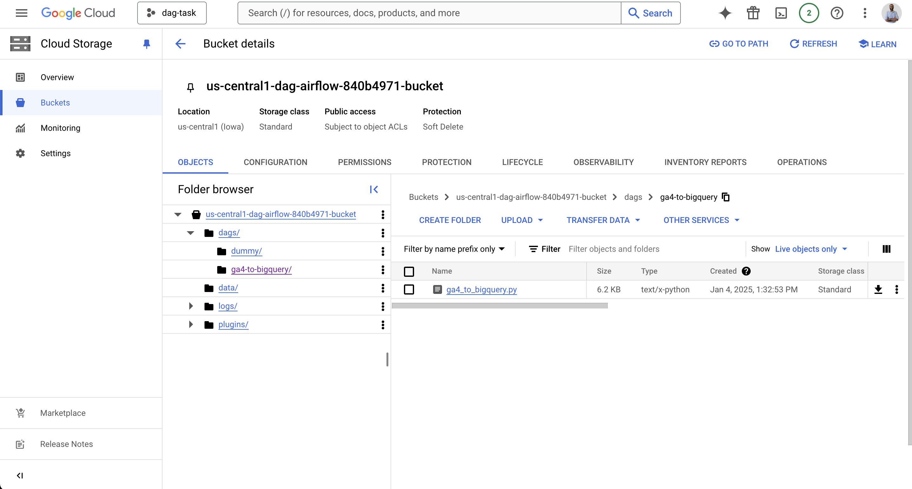

# Task

**Data Pipelines**
Create the following dag that takes the data from `google-analytics-events` and dumps it to `bigquery`
Go through the following README for the implementation steps and demo examples
https://github.com/yral-dapp/data-science-directed-acyclic-graphs/blob/main/README.md

# setup Airflow and GCP

- follow [setup.md](./setup.md)

# CICD

- just like copying dags to airflow/dags, setup github actions to push the DAG to the cloud storage bucket that is being used by the cloud composer environment

# Airflow configurations

- add google service account key to the airflow
  - Admin > Connections > google_cloud_default > Edit connection > Keyfile JSON > add the service account key
- add scopes of google analytics to the airflow

  - Admin > Connections > google_cloud_default > Edit connection > Extra > Scopes > add the following scopes:
    - use commas to separate the scopes
    - `https://www.googleapis.com/auth/analytics.readonly,https://www.googleapis.com/auth/cloud-platform,https://www.googleapis.com/auth/analytics`

# Screenshots

On successful creation of composer environment, your composer environment should look like this:

<p>
    
</p>

Once you run the dags, your composer environment should look like this:

<p>
    
</p>

On successful run of the dag, your airflow should look like this:

<p>
    
</p>

GCP bucket which holds events from google analytics should look like this:

<p>
    
</p>

Bucket which holds dags and airflow logs should look like this:

<p>
    

</p>

# Basic check data sanity

Run test script

- run the `test_google_analytics.py` file to verify the data is being pulled correctly from big query and google analytics

Output :

```bash
         date  activeUsers
0  2024-12-16            1
1  2024-12-18            2
2  2024-12-19            4
3  2024-12-21            1
4  2024-12-22            2
5  2024-12-23            1
6  2024-12-24            2
8  2024-12-26            6
12 2024-12-30            1
```

Cross verified from google big query

- run the same query in big query to verify the data is being pulled correctly

Query:

```sql
SELECT date,
       Sum(activeusers) AS daily_active_users
FROM   `dag-task.custom_analytics_data.ga4_data`
WHERE  date BETWEEN '20241216' AND '20241231'
GROUP  BY date
ORDER  BY date;
```

Output:

```csv
date,daily_active_users
2024-12-16,1
2024-12-18,2
2024-12-19,4
2024-12-21,1
2024-12-22,2
2024-12-23,1
2024-12-24,2
2024-12-26,6
2024-12-30,1
```
