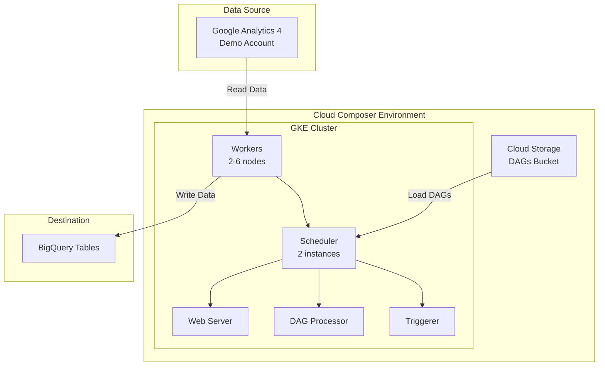

# Task

**Data Pipelines**
Create the following dag that takes the data from `google-analytics-events` and dumps it to `bigquery`
Go through the following README for the implementation steps and demo examples
https://github.com/yral-dapp/data-science-directed-acyclic-graphs/blob/main/README.md

# Steps to setup GCP for the task

1. Create a new project
2. Enable the APIs for the project
   - Google Analytics API
   - BigQuery API
   - Cloud Storage API
   - Cloud Composer API (for airflow)
3. Create a service account
4. Store secret key json in the secrets folder
5. Create Cloud Composer (airflow) environment

# Steps to get Analytics data

1. Get GA demo account by setting up new demo account using links here [GA demo account](https://support.google.com/analytics/answer/6367342?hl=en#zippy=%2Cin-this-article)
2. For this project i am using this [Google Merchandise Store's web data](https://analytics.google.com/analytics/index/demoaccount?appstate=/p213025502)
3. Get property id from Admin > Property > Property Details > Property ID
4. This property id will be required by airflow to get the data

# Architecture

