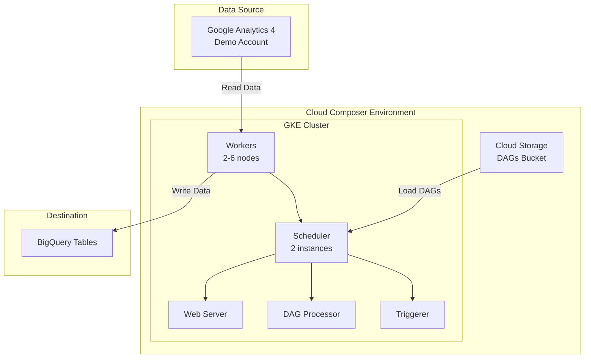

# Steps to setup GCP for the task

1. Create a new project
2. Create a service account
3. Run `gcp_commands.sh` to setup the permissions for the service account and then setup cloud composer environment
4. Create Cloud Composer (airflow) environment
5. Store secret key json in the secrets folder

# Steps to get Analytics data

1. Get GA demo account by setting up new demo account using links here [GA demo account](https://support.google.com/analytics/answer/6367342?hl=en#zippy=%2Cin-this-article)
2. For this project i am using this [Google Merchandise Store's web data](https://analytics.google.com/analytics/index/demoaccount?appstate=/p213025502)
3. Get property id it will be required by airflow to get the data

# get oauth2 client credentials

This is required to get the data from external GA account

1. Go to [Google Cloud Console](https://console.cloud.google.com/apis/credentials)
2. Setup and store OAuth 2.0 Client IDs json in the secrets folder

# Steps to create database for bigquery

# Architecture

